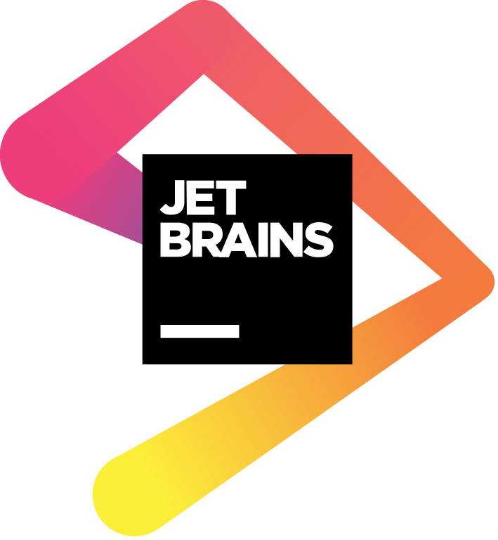
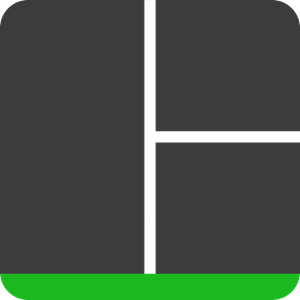
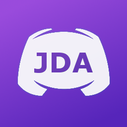
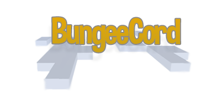

### Hello there! 👋 I'm LOSTED.
I'm a not-so-great, full of flaws, and nerdy high school child passionate/addicted to programming.

#### Programming languages I love

###### Programming language that I'm learning

#### Text editors/IDEs I use

#### Databases that I'm learning to use

#### Other cool tools I love

#### Other stuff I know

#### Woohoo! You can contact me through Discord! [LOSTED#8754]